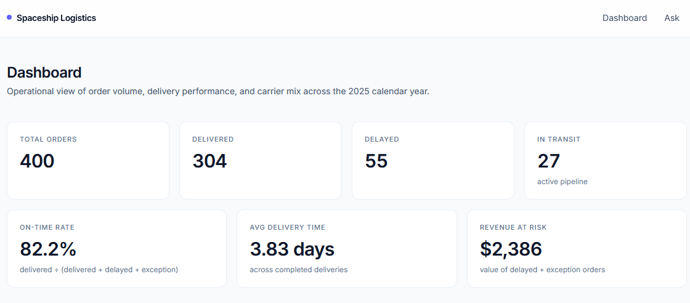
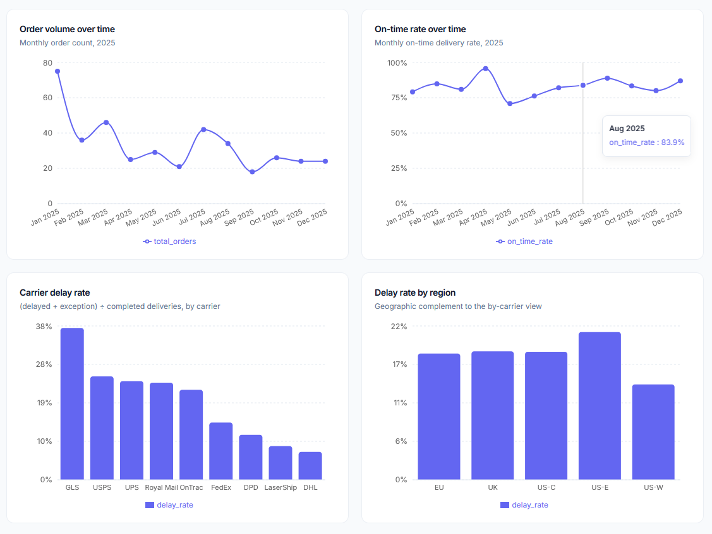
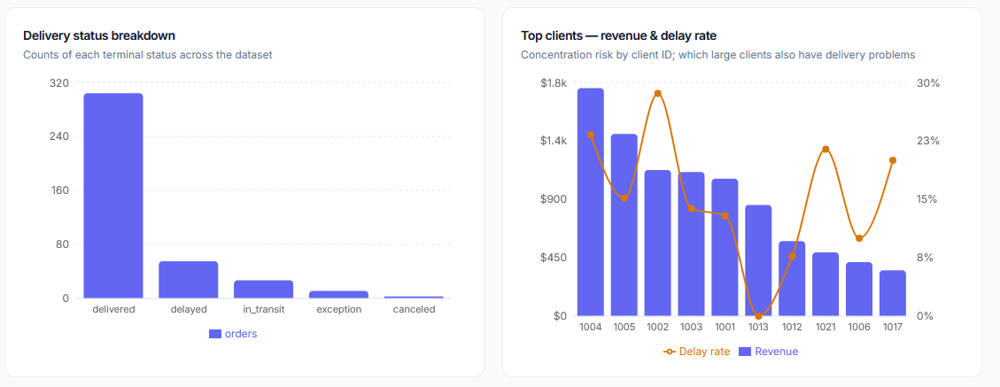
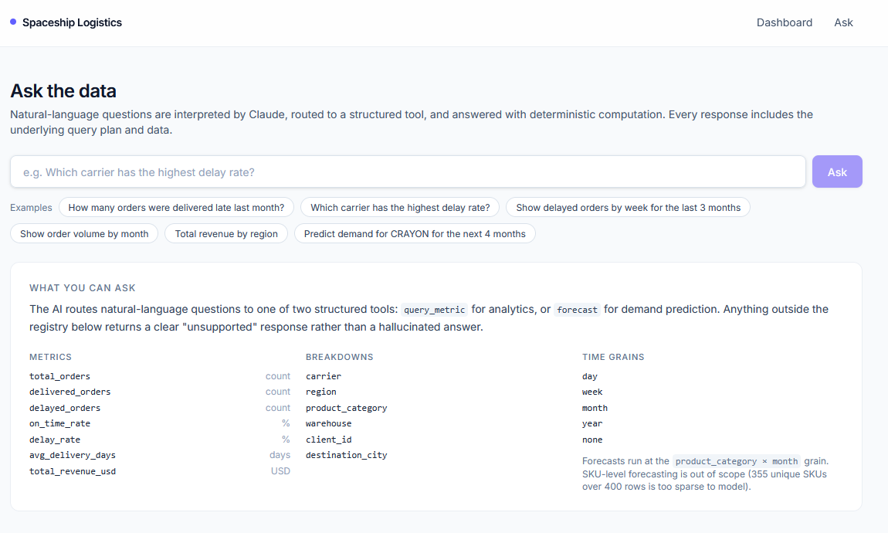
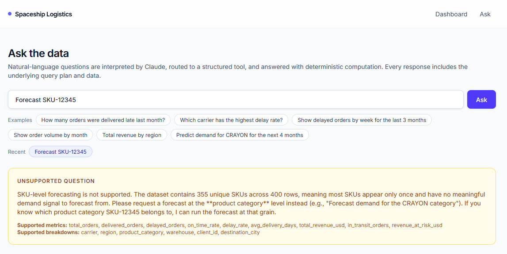
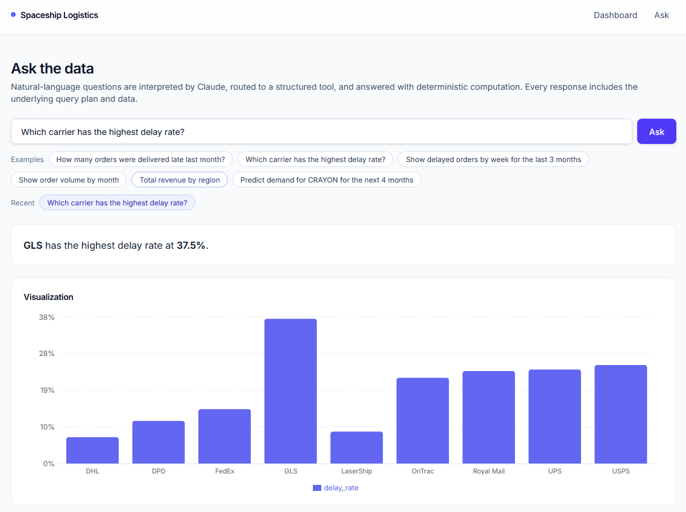
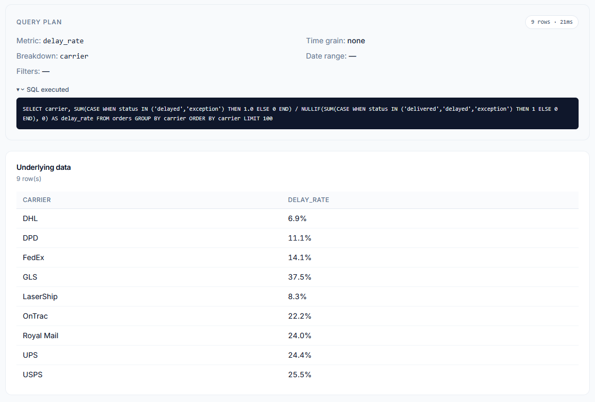
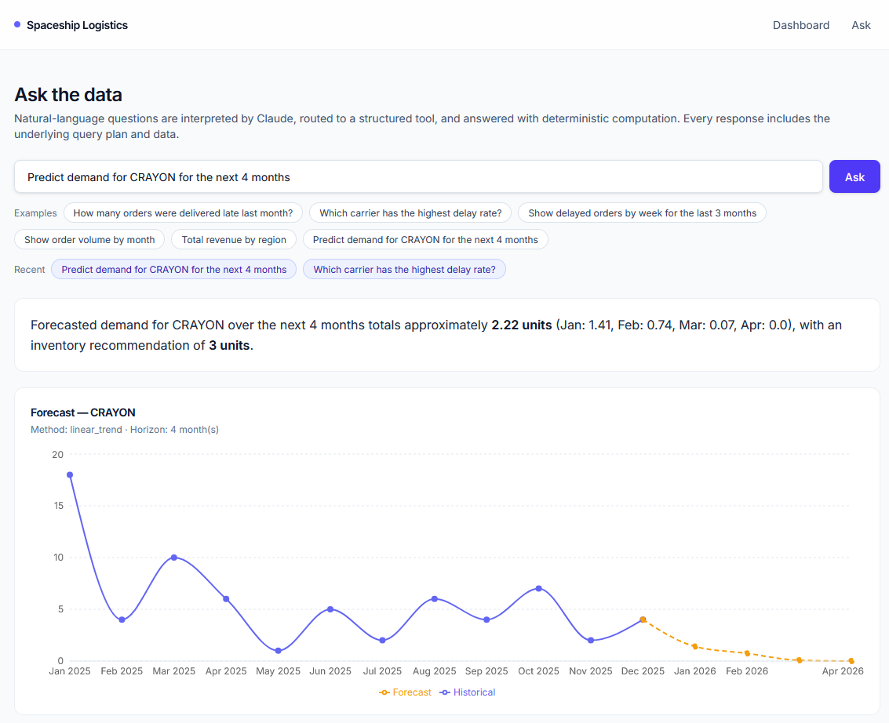
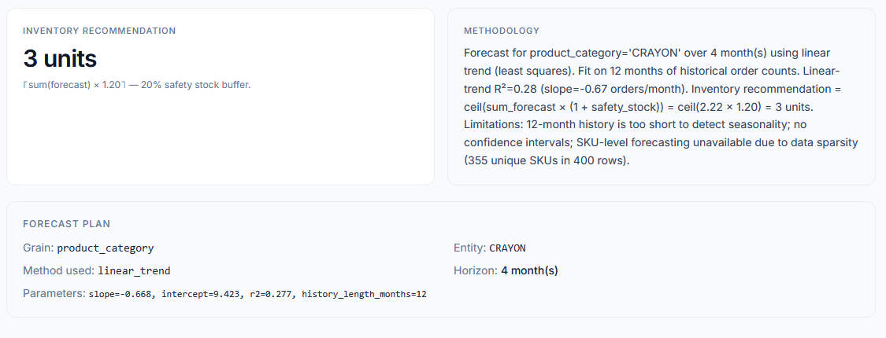
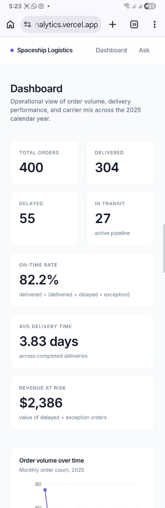

# Spaceship Logistics Analytics

AI-powered logistics analytics dashboard. Reviewers can read a fixed
operational dashboard, ask natural-language questions answered by deterministic
computation (no AI-generated SQL), and request demand forecasts at the
product-category level.

**Live:**
- Frontend (Vercel): <https://spaceship-logistics-analytics.vercel.app>
- Backend (Railway): <https://spaceship-logistics-analytics-production.up.railway.app>
- Repo: <https://github.com/KhresnaPanduI/spaceship-logistics-analytics>



---

## Table of contents

1. [Setup](#setup)
2. [Architecture](#architecture)
3. [AI approach](#ai-approach)
4. [Dataset and metrics](#dataset-and-metrics)
5. [Forecasting](#forecasting)
6. [Try these questions](#try-these-questions)
7. [Assumptions](#assumptions)
8. [Limitations](#limitations)
9. [Future improvements](#future-improvements)
10. [AI usage disclosure](#ai-usage-disclosure)

---

## Setup

Reviewers can use the deployed URLs above directly. Local setup is only needed
to run the code yourself.

**Prerequisites**: Python 3.12, Node 20+, [uv](https://docs.astral.sh/uv/), an
[OpenRouter](https://openrouter.ai/keys) API key with access to a Sonnet-class
Anthropic model.

```bash
# 1. Clone
git clone https://github.com/KhresnaPanduI/spaceship-logistics-analytics.git
cd spaceship-logistics-analytics

# 2. Backend — http://localhost:8765
cd backend
cp .env.example .env          # then fill in OPENROUTER_API_KEY
uv sync
uv run uvicorn app.main:app --reload --port 8765

# 3. Frontend — http://localhost:3000 (in a second terminal)
cd ../frontend
cp .env.local.example .env.local   # already points at localhost:8765
npm install
npm run dev
```

### Environment variables

**Backend** (`backend/.env`, see `backend/.env.example`):

| Variable | Required | Default | Purpose |
|---|---|---|---|
| `OPENROUTER_API_KEY` | yes | — | Auth for the LLM call. |
| `LLM_MODEL` | no | `anthropic/claude-sonnet-4.6` | OpenRouter model ID. |
| `OPENROUTER_BASE_URL` | no | `https://openrouter.ai/api/v1` | Override only if proxying. |
| `CORS_ORIGINS` | no | `http://localhost:3000` | Comma-separated allowed origins. |
| `SAFETY_STOCK_PCT` | no | `0.20` | Buffer multiplier for the inventory recommendation. |

**Frontend** (`frontend/.env.local`):

| Variable | Required | Purpose |
|---|---|---|
| `NEXT_PUBLIC_API_BASE_URL` | yes | Backend base URL (`http://localhost:8765` locally; the Railway URL in production). |

### Tests

```bash
cd backend && uv run pytest -q
```

Nine smoke tests cover registry validation, KPI numeric truth (304 delivered,
55 delayed, 82.2% on-time, etc.), `query_metric` correctness, and forecast
shape. They run offline — no LLM calls.

---

## Architecture

### System overview

A monorepo with two services:

```
spaceship-logistics-analytics/
├── backend/    FastAPI + DuckDB + Pydantic    (Python 3.12, deployed on Railway)
└── frontend/   Next.js 15 App Router + Recharts  (deployed on Vercel)
```

The backend is a thin layer over a **metric registry**. The registry declares
every metric, dimension, and time grain the system can compute. Both the LLM's
tool schemas and the dashboard endpoints read from this same module — there is
**one computation path**, used by both the AI and the dashboard. Adding a new
metric is a single-file edit.




### Key design decisions

**1. Single-agent + metric registry + structured tools (no raw AI-generated SQL).**

The LLM never writes SQL. It picks one of two tools — `query_metric` or
`forecast` — and fills in a Pydantic-validated input. The validator rejects any
metric, breakdown, or filter field not declared in the registry. The selected
tool then builds SQL from the **registry's** aggregate expressions, not from
LLM output.

This is the 2025 production-default for LLM analytics, motivated by the
accuracy gap between raw text-to-SQL and tool-routed semantic-layer
approaches:

- Cube's paired benchmark: a semantic layer in front of an LLM lifts answer
  accuracy by **17–23 percentage points** over raw text-to-SQL.
  ([Cube · "How a semantic layer makes LLMs more reliable"](https://cube.dev/blog/semantic-layer-llm-accuracy))
- Snowflake's Cortex Analyst report: **~40% → 85–90% accuracy** moving from
  raw text-to-SQL to a semantic-model-bound approach.
  ([Snowflake · Cortex Analyst announcement](https://www.snowflake.com/en/engineering-blog/cortex-analyst-ai-bi/))

The two structured tools follow Anthropic's tool-use pattern: the model emits
a `tool_call` with JSON arguments, the host application validates and
executes, then optionally feeds the result back for a natural-language
summary.
([Anthropic · Tool use overview](https://docs.anthropic.com/en/docs/agents-and-tools/tool-use/overview))

**2. Two LLM calls, no ReAct loop.**

Per `/api/ask` request:

1. Tool-selection call: question + tool schemas → tool choice with arguments.
2. Summarisation call: structured tool result → 1–2 sentence English answer.

The summariser is *only* allowed to restate the numbers the tool returned. No
critic, no retry, no multi-turn reasoning. This keeps the architecture
auditable and bounds latency/cost. Multi-step compositional questions
(*"compare X to Y over Z"*) are out of scope for the MVP and explicitly listed
under [Future improvements](#future-improvements).

**3. DuckDB in-process, view over the CSV.**

400 rows. A real database would be over-engineered. DuckDB gives us SQL with
proper types, parameter binding, and date functions in a single dependency,
loaded once at startup. Connection is a process-singleton; thread safety comes
from per-request `.cursor()`.

**4. Dashboard endpoints reuse the registry.**

`GET /api/kpis` and the `/api/charts/*` endpoints call the **same**
`run_query_metric()` the AI calls. This guarantees the dashboard numbers and
AI-answered numbers cannot diverge — they share one execution path. Two charts
that need a metric pair (carrier delay rate, top-clients revenue + delay)
fall back to inline SQL with the same status semantics, documented per
endpoint.

### Data flow

```
User question
  │
  ▼  POST /api/ask
┌─────────────────────────────────────────────────────────────────┐
│ 1. LLM call (tool selection)                                     │
│    system prompt = registry summary (~1KB)                       │
│    tools = [query_metric, forecast]                              │
│    tool_choice = "auto"                                          │
└─────────────────────────────────────────────────────────────────┘
  │
  ▼ tool_call(name, args)
┌─────────────────────────────────────────────────────────────────┐
│ 2. Pydantic validation against registry                          │
│    - metric in METRICS?                                          │
│    - breakdown in BREAKDOWNS?                                    │
│    - filter fields in DIMENSIONS?                                │
│    - date_from <= date_to?                                       │
│    invalid → structured "unsupported" response (no retry)        │
└─────────────────────────────────────────────────────────────────┘
  │
  ▼ valid
┌─────────────────────────────────────────────────────────────────┐
│ 3. Deterministic execution                                       │
│    query_metric → build SQL from registry, run on DuckDB         │
│    forecast    → pandas + numpy.polyfit / moving average         │
└─────────────────────────────────────────────────────────────────┘
  │
  ▼
┌─────────────────────────────────────────────────────────────────┐
│ 4. LLM call (summarisation)                                      │
│    "Summarise this tool result in 1-2 sentences. Restate only    │
│     numbers; do not invent values."                              │
└─────────────────────────────────────────────────────────────────┘
  │
  ▼  { kind, answer, result: { rows, plan, viz_spec } }
Frontend renders chart + answer + plan panel + data table
```

---

## AI approach

### How questions are interpreted

The system prompt declares the model's role, lists the two available tools,
and embeds a compact registry summary (metric names + units + descriptions,
allowed breakdowns, filter fields, time grains, the data window, and the
SKU-level forecast restriction). The whole prompt is ~1KB and is regenerated
from the registry on every request — there is no second copy of "what's
supported" anywhere in the system.

The empty `/ask` page exposes that same registry to the user, so they can see
the supported surface before typing:



### How tools are selected

The LLM picks one of:

- **`query_metric`** — descriptive analytics. Inputs: `metric`, optional
  `breakdown`, optional `time_grain`, optional `filters`, optional date range,
  `limit`. Output: a list of rows, the executed SQL, and a `viz_spec` (line /
  bar / number / table) chosen by code, not by the LLM.
- **`forecast`** — demand prediction at `product_category × month` grain.
  Inputs: `entity` (category name), `horizon_months` (1–6), `method`
  (`auto` / `moving_average` / `linear_trend`). Output: historical series,
  forecast series, inventory recommendation, and a methodology string.

If the question doesn't fit either tool the model is instructed to reply in
plain text starting with `UNSUPPORTED:` rather than calling a tool. The
backend converts this into a structured rejection that includes the supported
metric and breakdown lists, so the user can immediately reformulate:



### Explainability

Every `/ask` response carries the full **query plan** alongside the answer:
metric, breakdown, time grain, filters, date range, the executed SQL string,
row count, and execution time. This is shown to the user directly — there is
no hidden computation the user cannot inspect.




The two-call architecture means: numbers come from SQL the user can read; the
LLM only renders an English summary on top.

---

## Dataset and metrics

The dataset is a single CSV: 400 rows covering 2025-01-01 → 2025-12-30.

| Field | Notes |
|---|---|
| Rows | 400 |
| Clients | 30 (`CL-1001`..`CL-1030`) |
| Carriers | 9 (FedEx, UPS, DHL, USPS, OnTrac, LaserShip, Royal Mail, DPD, GLS) |
| Regions | 5 (US-E, US-W, US-C, EU, UK) |
| Product categories | 8 |
| Warehouses | 9 (1:1 with origin city) |
| Unique SKUs | 355 (≈ one per row — too sparse to forecast) |

Status distribution: 304 delivered, 55 delayed, 27 in_transit, 11 exception,
3 canceled.

**Metrics (9)** — surfaced via the registry: `total_orders`,
`delivered_orders`, `delayed_orders`, `on_time_rate`, `delay_rate`,
`avg_delivery_days`, `total_revenue_usd`, `in_transit_orders`,
`revenue_at_risk_usd`.

**Breakdowns (6)** — `carrier`, `region`, `product_category`, `warehouse`,
`client_id`, `destination_city`. (`status` is intentionally a filter, not a
breakdown — most metrics already encode status logic.)

**Time grains** — `day`, `week`, `month`, `year`, `none`.

`on_time_rate = delivered / (delivered + delayed + exception)`. `in_transit`
and `canceled` are excluded from the denominator because they have no
completion outcome yet. `delay_rate` is the strict complement.

---

## Forecasting

Implemented at **`product_category × month`** grain only. SKU-level forecasts
are explicitly rejected with a message routing the user to category grain;
355 unique SKUs over 400 rows means most SKUs appear once, with no signal to
fit.

**Method selection** (auto-selected unless overridden):

- `linear_trend` — `numpy.polyfit(x, y, 1)`, 12 months of history → projection
  for the requested horizon. Negatives clipped to 0. Used when the series has
  ≥ 6 non-zero months.
- `moving_average` — window=3 of the last 3 non-zero months, projected as a
  flat value. Used for sparse series.

Holt-Winters / ARIMA were considered and **explicitly excluded** — 12 monthly
observations is below the standard ≥ 2 full seasonal cycles required for
seasonal models to be meaningful.

**Inventory recommendation**: `ceil(sum(forecast) × 1.20)` units. The 20%
safety-stock buffer is a single config constant (`SAFETY_STOCK_PCT`) and is
restated in the methodology string returned with every forecast.




---

## Try these questions

Paste these into `/ask`:

1. *Which carrier has the highest delay rate?*
2. *Show order volume by month*
3. *Total revenue by region*
4. *How many delayed orders did we have in Q3 2025?*
5. *Predict demand for CRAYON for the next 4 months*
6. *Forecast SKU-12345* — to see the structured rejection.

The dashboard at `/` renders the same metrics through the same registry
without an LLM in the path, so the two views always agree.

---

## Assumptions

1. **"Delayed" is taken from the `status` column** rather than derived from
   `delivery_date - expected_delivery_date`. The dataset's `delayed` status is
   trustworthy and avoids a parallel definition that could drift.
2. **`on_time_rate` denominator excludes `in_transit` and `canceled`.** Those
   orders have no completion outcome, so including them would dilute the rate.
3. **Origin city == warehouse** (1:1 in the data), so they're treated as one
   dimension in the registry.
4. **`total_revenue_usd` is raw `order_value_usd`**, not net of promo
   discounts. The discount field is sparse (n=22) and not consistently signed.
5. **Time-relative phrasing** (*"last month"*, *"Q3"*) is interpreted relative
   to the **data window's end (2025-12-30)**, not today's date. This is stated
   in the system prompt so the LLM behaves consistently.
6. **Forecast safety stock is fixed at 20%.** A real implementation would
   tune this per SKU based on holding cost vs stockout cost; out of scope.

---

## Limitations

The system **will not** answer:

- **Multi-step / compositional questions** like *"compare carrier delay rates
  between Q1 and Q3"* — would require two `query_metric` calls and a
  comparison step. Single-tool architecture only for MVP.
- **SKU-level forecasts** — rejected with a clear message because 355 SKUs
  over 400 rows is too sparse.
- **Seasonal forecasts** (Holt-Winters, ARIMA) — 12 monthly observations is
  below the cycles needed for seasonal decomposition.
- **Confidence intervals on forecasts** — the methodology string says so
  explicitly. Adding bootstrapped intervals is a clean extension but not in
  scope.
- **Free-form filter values** the LLM might invent — the validator rejects
  filter fields outside `DIMENSIONS`, so e.g. *"orders where the customer is
  important"* is structured-rejected rather than guessed.
- **Anything outside the registry** — the system replies with `UNSUPPORTED:`
  + the full list of supported metrics and breakdowns rather than
  hallucinating an answer.

The `/ask` page is responsive — KPI tiles stack and chart x-axis labels
auto-tilt on narrow viewports — but is optimised for desktop reading.



---

## Future improvements

Each item below is **deliberately out of scope**, with the reason recorded so
the trade-off is auditable.

| Feature | Why deferred |
|---|---|
| **Multi-step / compositional queries** | Needs a planner that decomposes a question into multiple tool calls + a combiner step. Doable with a small ReAct loop, but pushes us out of the "two LLM calls, no retry" architecture that makes the current design auditable. Worth adding behind a feature flag once an evaluation harness exists. |
| **Caching** | Premature for a 400-row dataset where queries run in <20ms (the badge in the plan panel shows this). Adding cache layers without latency or cost pressure would be cargo-culting. |
| **Docker** | Railway already builds a reproducible container via Nixpacks. A Dockerfile would duplicate that without adding portability for the current target. Easy to add if Railway is later swapped for a generic runner. |
| **Ambiguous-query clarification loop** | Multi-turn dialog — *"did you mean carrier or region?"* — contradicts the one-shot tool-call architecture. Adding it requires session state and a second LLM round-trip. Better surfaced via the "supported metrics" list in unsupported responses, which serves the same purpose without state. |
| **Confidence intervals on forecasts** | Bootstrapped intervals from the residuals would be straightforward; cut for time. The methodology string already discloses the lack of CIs. |
| **Holt-Winters / SARIMA seasonality** | 12 monthly observations is below the ≥ 2 seasonal cycles these models need. Would add false confidence rather than accuracy. Revisit when ≥ 24 months of data exist. |
| **Auth / multi-tenancy / query history persistence** | Take-home is single-tenant with no PII. Recent-questions chips on `/ask` give per-session history without a backend store. |
| **LLM-judge verifier / critic** | Useful when answers are free-form text. Our answers come from deterministic SQL the user can already read; an LLM critic would only check the summary, not the numbers. Higher value once compositional queries exist. |
| **Sentry / structured logging / metrics** | Would be the first thing added in a real deployment. Out of scope for a take-home where the bottleneck is a public URL the reviewer can hit, not observability under load. |

---

## AI usage disclosure

This project was built with substantial AI assistance. The full disclosure —
which decisions were mine, which were Claude's, what was generated end-to-end,
and what was reviewed and modified — is in [`AI_USAGE.md`](AI_USAGE.md).
